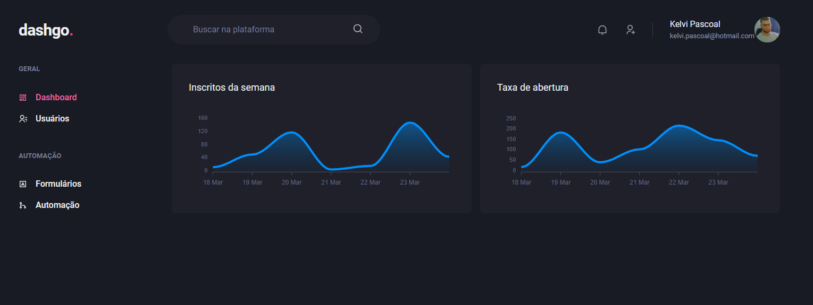
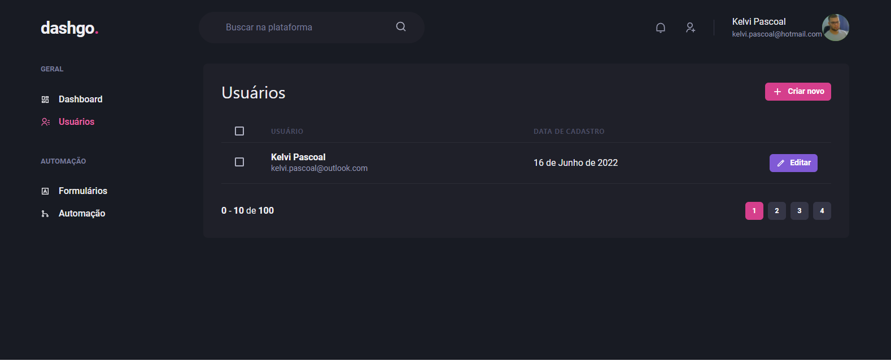
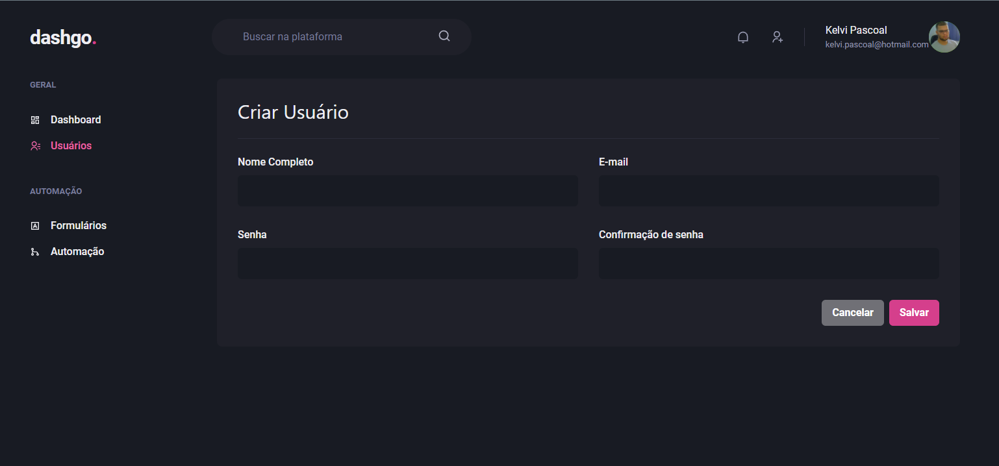
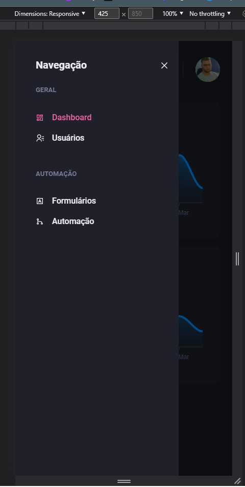

This is a [Next.js](https://nextjs.org/) project bootstrapped with [`create-next-app`](https://github.com/vercel/next.js/tree/canary/packages/create-next-app).

# Interfaces do futuro

## Getting started

First, run the development server:

```bash
npm run dev
# or
yarn dev
```

## Tools used

- <a href="https://nextjs.org/">Next</a>
- <a href="https://www.typescriptlang.org/">TypeScript</a>
- <a href="https://chakra-ui.com/">Chakra UI</a>
- <a href="https://apexcharts.com/docs/react-charts/">React Apexcharts</a>
- <a href="https://docs.pmnd.rs/zustand/introduction">Zustand</a>
- <a href="https://react-hook-form.com/">React Hook Form</a>
- <a href="https://github.com/jquense/yup">Yup</a>

## Overview

  



